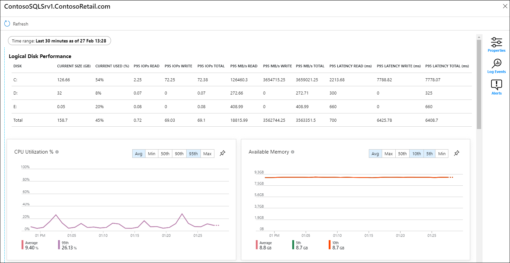
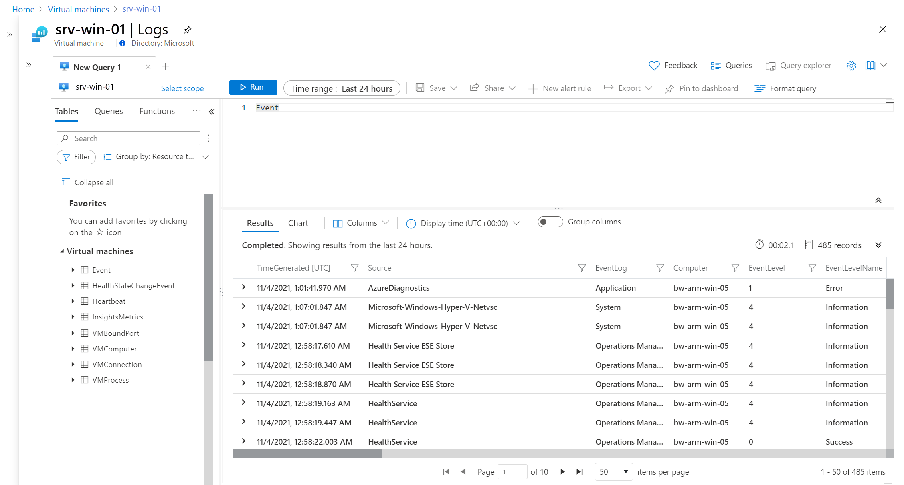
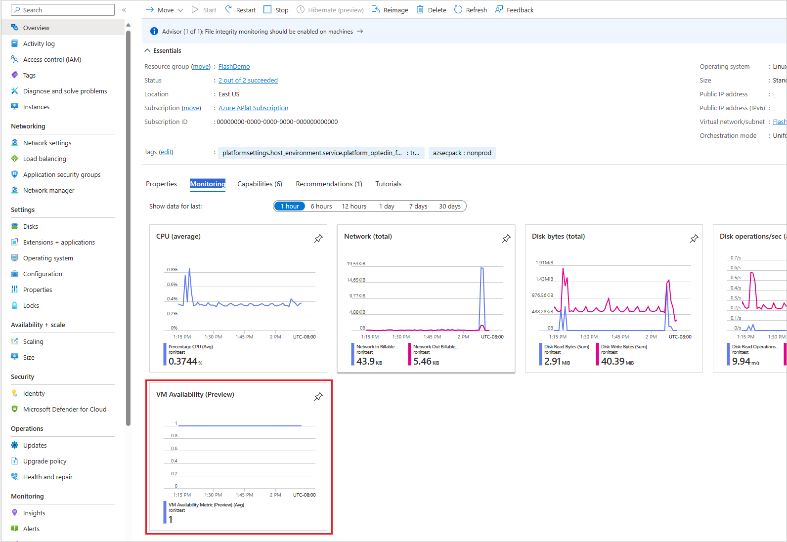
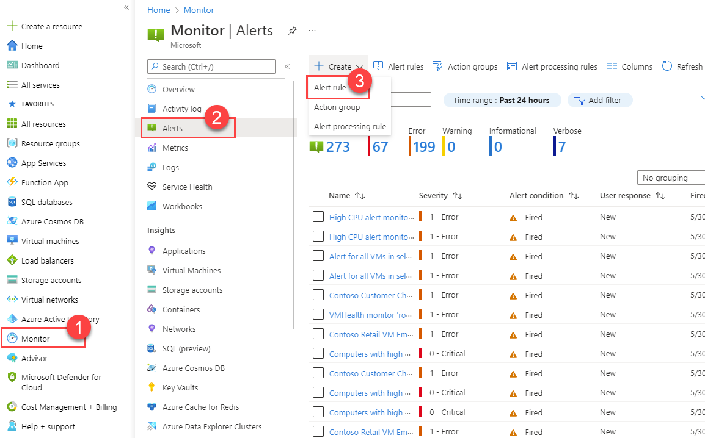
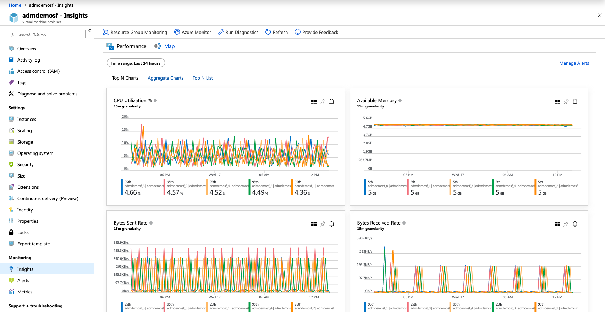

# Guia de Monitoramento de Máquinas Virtuais no Microsoft Azure

## Objetivo do monitoramento

Manter visibilidade, controle e resposta proativa sobre o ambiente, garantindo:

- Disponibilidade dos recursos
- Performance adequada para os workloads
- Detecção de falhas ou alterações críticas (ex: exclusão acidental de VM)
- Atuação rápida antes de impacto ao negócio

## 1. Conceitos fundamentais de monitoramento no Azure

### Azure Monitor

É o serviço centralizado de monitoramento no Azure, permitindo coletar, analisar e agir com base em métricas e logs. Inclui:

- Metrics: dados numéricos em tempo real (CPU, disco, rede).
- Logs (Log Analytics): dados detalhados de atividades, segurança, alterações e diagnósticos.
- Alerts: notificações automáticas com base em métricas ou logs, gerando ação imediata.
- Insights: dashboards pré-prontos para VMs, bancos de dados, Application Gateway, entre outros.

### Azure Activity Log

Registro de todas as ações realizadas no nível de subscription (ex: criação, alteração, exclusão de VMs). Ideal para rastrear mudanças críticas, auditoria e compliance.

### Log Analytics Workspace

Armazena logs coletados dos recursos. Possui:

- Linguagem KQL (Kusto Query Language) para consultas avançadas.
- Conexão com Azure Monitor, Security Center e Sentinel.
- Exemplo prático: Consultar VMs criadas ou deletadas no último mês.

### Alertas no Azure

São criados para notificar operações críticas. Por exemplo:

- CPU acima de 80% por 5 minutos.
- Falha no backup de VM.
- Exclusão de VM detectada (via Activity Log).

## 2. Monitoramento de exclusão de VM – Caso prático

### Por que monitorar exclusões de VMs?

- Exclusões acidentais ou maliciosas geram indisponibilidade.
- Pode afetar aplicações críticas sem backup ou replicação.
- Monitorar exclusões é essencial para segurança, governança e continuidade do negócio.

### Como configurar um alerta de exclusão de VM

1.  Acesse Azure Monitor no portal.
2.  Vá em Alerts > New Alert Rule.
3.  Scope: selecione a subscription ou resource group onde estão as VMs.
4.  Condition: escolha “Administrative” → “Delete Virtual Machine (Microsoft.Compute/virtualMachines/delete)” no Activity Log.
5.  Action Group: configure email, SMS, webhook ou função automatizada para resposta imediata.
6.  Alert Details: defina nome, severidade (Critical) e descrição clara.
7.  Review + Create: revise e crie o alerta.

### Exemplo prático de consulta KQL para exclusão de VM

```kusto
AzureActivity
| where OperationNameValue == "Microsoft.Compute/virtualMachines/delete"
| project TimeGenerated, ResourceGroup, Resource, Caller, ActivityStatusValue
| order by TimeGenerated desc
```

## 3. Dicas práticas para monitoramento de VMs

Habilite boot diagnostics e guest diagnostics para insights de inicialização e performance.

Configure auto-shutdown para VMs de desenvolvimento e receba notificação antes do desligamento.

Use action groups com múltiplos canais (email, SMS, Teams) para alertas críticos.

Integre com Azure Sentinel para detecção de ameaças em tempo real e automação de resposta.

Crie dashboards personalizados no Azure Monitor para exibir métricas e alertas em um único painel.

Implemente políticas (Azure Policy) que exijam monitoramento habilitado em todas as VMs criadas.

## 4. Boas práticas de governança e segurança

Princípio de menor privilégio: apenas equipes autorizadas podem excluir recursos críticos.

Lock de recursos: use ReadOnly ou Delete Lock para impedir exclusão acidental.

Ative logs de diagnóstico e exporte para Log Analytics ou Storage Account para compliance.

Automatize resposta a alertas críticos (ex: recriar VM deletada via Logic Apps ou Automation Runbook).

## TUTORIAL: Criando alertas no Portal do Azure

### 1. Alerta de CPU alta

Cenário: Monitorar quando o uso de CPU de uma VM passa de 80% por mais de 5 minutos.

#### Passo a passo no Portal

1.  Acesse Azure Monitor no portal.
2.  Clique em Alerts > New Alert Rule.
3.  Scope: clique em Select resource, escolha sua VM.
4.  Condition:
    a.  Clique em Add condition.
    b.  Selecione Percentage CPU.
    c.  Configure: Greater than 80, Aggregation type = Average, Period = 5 minutes.
5.  Action group:
    a.  Se já existir, selecione.
    b.  Senão, clique em Create action group para configurar email, SMS ou webhook.
6.  Alert Details:
    a.  Name: Alerta - CPU Alta
    b.  Severity: 2 (Warning) ou 1 (Critical).
7.  Clique em Review + Create.

### 2. Alerta de Disco cheio

Cenário: Monitorar quando o disco C: está acima de 90% de uso.

#### Passo a passo no Portal

1.  Acesse Azure Monitor.
2.  Clique em Alerts > New Alert Rule.
3.  Scope: selecione sua VM.
4.  Condition:
    a.  Clique em Add condition.
    b.  Procure Logical Disk Space Used % (caso guest diagnostics esteja habilitado).
    c.  Configure: Greater than 90, Aggregation type = Average, Period = 5 minutes.
5.  Configure Action Group e Alert Details como no exemplo anterior.
6.  Review + Create.

### 3. Alerta de Falha em Backup

Cenário: Receber alerta se o backup de VM falhar.

#### Passo a passo no Portal

1.  Acesse Azure Monitor.
2.  Vá em Alerts > New Alert Rule.
3.  Scope: selecione o Recovery Services Vault que gerencia o backup da VM.
4.  Condition:
    a.  Clique em Add condition.
    b.  Selecione Backup Item Backup Status.
    c.  Configure: Status equals Failed.
5.  Configure Action Group (email, SMS, webhook).
6.  Em Alert Details, nomeie como Alerta - Falha em Backup VM.
7.  Review + Create.

### 4. Alerta de Exclusão de VM

Cenário: Ser avisado imediatamente quando alguém excluir uma VM.

#### Passo a passo no Portal

1.  Acesse Azure Monitor.
2.  Clique em Alerts > New Alert Rule.
3.  Scope: selecione a assinatura ou resource group onde estão as VMs.
4.  Condition:
    a.  Clique em Add condition.
    b.  Escolha Administrative Activity Log.
    c.  Filtre por Operation Name: Delete Virtual Machine (Microsoft.Compute/virtualMachines/delete).
5.  Configure Action Group e Alert Details.
6.  Review + Create.

### 5. Alerta de alteração em NSG ou VNet

Cenário: Ser avisado sobre qualquer alteração em NSG ou VNet (criação, deleção, modificação).

#### Passo a passo no Portal

1.  Acesse Azure Monitor.
2.  Clique em Alerts > New Alert Rule.
3.  Scope: selecione a assinatura ou resource group desejado.
4.  Condition:
    a.  Clique em Add condition.
    b.  Escolha Administrative Activity Log.
    c.  Filtre por Resource Type:
        i.  Microsoft.Network/networkSecurityGroups
        ii. Microsoft.Network/virtualNetworks
5.  Configure Action Group e Alert Details (ex: Alerta - Alteração NSG ou VNet).
6.  Review + Create.

## SCRIPTS PowerShell para criação de alertas

**Observação importante**

Os exemplos abaixo criam alertas básicos. Ajuste Resource IDs, Action Group IDs e thresholds conforme seu ambiente.

### Script PowerShell – Alerta de CPU Alta

```powershell
# Login no Azure
Connect-AzAccount
# Variáveis
$resourceGroup = "rg-monitor"
$vmName = "vm-example"
$actionGroupName = "ag-alerts"
$scope = "/subscriptions/<subscription-id>/resourceGroups/$resourceGroup/providers/Microsoft.Compute/virtualMachines/$vmName"
$actionGroupId = "/subscriptions/<subscription-id>/resourceGroups/$resourceGroup/providers/microsoft.insights/actionGroups/$actionGroupName"
# Criar regra de alerta para CPU > 80%
Add-AzMetricAlertRuleV2 -Name "CPU-High-Alert" -ResourceGroupName $resourceGroup `
-TargetResourceId $scope `
-WindowSize (New-TimeSpan -Minutes 5) `
-Frequency (New-TimeSpan -Minutes 1) `
-Condition @(New-AzMetricAlertRuleV2Criteria -MetricName "Percentage CPU" -TimeAggregation Average -Operator GreaterThan -Threshold 80) `
-ActionGroupId $actionGroupId `
-Severity 2 -Description "CPU usage is above 80% for 5 minutes"
```

### Script PowerShell – Alerta de Exclusão de VM

```powershell
# Variáveis
$alertName = "VM-Deletion-Alert"
$scopeSub = "/subscriptions/<subscription-id>"
$condition = New-AzScheduledQueryRuleSource -Query "AzureActivity | where OperationNameValue == \'Microsoft.Compute/virtualMachines/delete\'" -DataSourceId $scopeSub
$actionGroupId = "/subscriptions/<subscription-id>/resourceGroups/$resourceGroup/providers/microsoft.insights/actionGroups/$actionGroupName"
New-AzScheduledQueryRule -ResourceGroupName $resourceGroup -Name $alertName -Location "East US" `
-Action @(New-AzScheduledQueryRuleAction -ActionGroup $actionGroupId) `
-Description "Alert for VM deletion activity" `
-Enabled $true -Source $condition -ScheduleFrequencyInMinutes 5 -ScheduleTimeWindowInMinutes 5
```

## SCRIPTS Azure CLI para criação de alertas

### Script CLI – Alerta de CPU Alta

```bash
# Variáveis
resourceGroup="rg-monitor"
vmName="vm-example"
actionGroupName="ag-alerts"
vmId=$(az vm show -g $resourceGroup -n $vmName --query id -o tsv)
# Criar alerta CPU > 80%
az monitor metrics alert create \
--name "CPU-High-Alert" \
--resource-group $resourceGroup \
--scopes $vmId \
--condition "avg Percentage CPU > 80" \
--description "CPU usage is above 80% for 5 minutes" \
--action "/subscriptions/<subscription-id>/resourceGroups/$resourceGroup/providers/microsoft.insights/actionGroups/$actionGroupName"
```

### Script CLI – Alerta de Exclusão de VM

```bash
# Criar alerta baseado em Activity Log para exclusão de VM
az monitor activity-log alert create \
--name "VM-Deletion-Alert" \
--resource-group $resourceGroup \
--scopes "/subscriptions/<subscription-id>" \
--condition "category=\'Administrative\' and operationName=\'Microsoft.Compute/virtualMachines/delete\'" \
--action-group "/subscriptions/<subscription-id>/resourceGroups/$resourceGroup/providers/microsoft.insights/actionGroups/$actionGroupName"
```

## Resumo Final

Esses tutoriais e scripts permitem:

✔ Monitorar performance (CPU, disco)

✔ Detectar falhas críticas (backup)

✔ Garantir segurança e governança (exclusão de VM, alterações em rede)

✔ Responder rapidamente a incidentes via alertas e action groups


## Imagens de Referência

- **Visão Geral do Monitoramento de VM:**
  - 
- **Dashboard de VM Insights:**
  - 
- **Visão Geral de Métricas de VM:**
  - 
- **Visão Geral de Alertas do Azure Monitor:**
  - 
- **Criação de Regra de Alerta:**
  - 
- **Gráfico de Performance de VM:**
  - 


